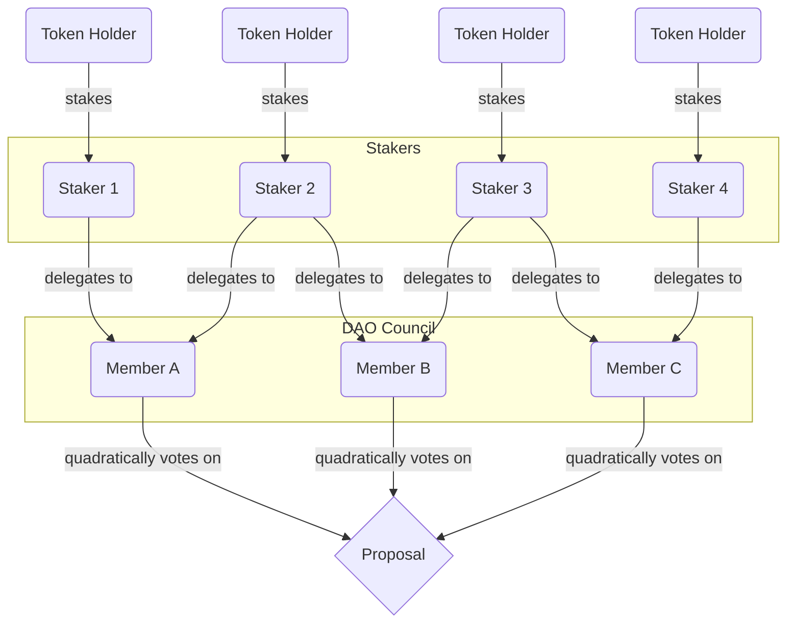

# Crynux DAO Whitepaper

Fully democratic, open, and community-driven governance of the Crynux Network

## Abstract

The Crynux DAO is a Decentralized Autonomous Organization dedicated to guiding the development of the Crynux Network. Its mission is to ensure the network remains a community-driven, open, and transparent decentralized platform for AI computation over the long term. The governance of the Crynux DAO rests entirely in the hands of CNX token holders, who collectively determine the network's future through a democratic voting process.

This document provides a detailed overview of the Crynux DAO's governance structure, operational mechanisms, treasury management, and its pivotal role within the Crynux ecosystem.

## 1. Vision and Mission

The Crynux Network is committed to building a global Decentralized AI Infrastructure. To realize this ambitious goal and ensure its sustainable growth, we believe that robust, active, and genuinely decentralized community governance is essential.

The core vision of the Crynux DAO is threefold:

*   **True Democracy**: To place the ownership and governance of the network firmly in the hands of the community. Every CNX token holder has the opportunity to participate in shaping the network's future.
*   **Openness and Transparency**: All governance decisions and the use of funds will be conducted publicly and transparently, subject to the oversight of the entire community.
*   **Community-Driven Growth**: To harness the collective wisdom of the DAO to guide the network's technological advancements, ecosystem development, and economic model, ensuring that all actions align with the best interests of the community.

## 2. Governance Model

The Crynux DAO's governance is built on a sophisticated, multi-layered model designed to balance stakeholder influence with fair and effective decision-making. The process unfolds across three distinct tiers:

**Tier 1: Stake-to-Participate**
The foundation of DAO governance rests on the principle of "skin in the game." Only CNX token holders who stake their tokens in the designated smart contract become active participants in the DAO. This act of staking grants them governance rights, including the crucial ability to delegate their voting power, and separates active, committed stakeholders from passive token holders.

**Tier 2: Delegated Proof-of-Stake (DPoS) for Representation**
To ensure efficient governance, Crynux DAO employs a liquid democracy model based on Delegated Proof-of-Stake. Instead of voting on every proposal themselves, stakers delegate their stake to an address they trust to represent their interests. The top 7 addresses with the most delegated stake automatically form the DAO Council. This DPoS layer ensures that council members have a significant, stake-weighted mandate from the community.

**Tier 3: Quadratic Voting (QV) for Decision-Making**
While the council's composition is determined by stake, its internal decision-making process is governed by Quadratic Voting. This mechanism is designed to mitigate the risk of plutocracy and foster more democratic outcomes. The Voting Weight of each council member is calculated as the square root of their delegated stake at the time of a proposal's snapshot. This significantly narrows the power gap between members, forcing decisions to be made based on conviction and consensus rather than raw capital dominance. It prevents a single large delegate from overpowering the council and ensures that minority opinions with strong conviction can have a meaningful impact.

## 3. The Crynux DAO Council

The DAO Council is the executive arm of the Crynux DAO. It is elected by the community and is entrusted with managing the network in the community's best interests.

### 3.1 Council Composition

The `top 7` addresses with the largest amount of delegated stake automatically become council members.

Council membership is not based on fixed terms. Since staking amounts and delegated stake can be changed at any time, council membership is highly dynamic. Members will join or leave the council based on the real-time distribution of delegated stakes.

To ensure that decision-making remains orderly and predictable amidst this fluidity, the Crynux DAO employs a critical snapshot mechanism. When a new proposal is created, the system instantly captures a snapshot of the council's composition and delegated staking. The entire lifecycle of the proposal, from voting to execution, is bound to this immutable snapshot.

This snapshot model strikes a deliberate balance, pairing the long-term flexibility and
accountability of a dynamic council with the short-term stability required for sound,
case-by-case governance.

### 3.2 The Council Convener

To ensure the Council operates effectively and proactively drives the DAO's initiatives, the **Council Convener** is elected by the Council members through the standard proposal and voting process. The Convener is not a privileged leader but a coordinator and facilitator, chosen by their peers to guide the Council's work.

**Election and Term:**
- The Convener is elected for a fixed term of 6 months.
- Before the current term expires, a new election must be conducted to either re-elect the current Convener or select a new one.
- Any current Council member is eligible to be nominated for the Convener position.

**Removal Mechanisms:**
- **Voluntary Removal:** Council members may initiate a proposal to remove the current Convener. Such proposals require a two-thirds (2/3) supermajority of the Council's voting weight to pass. Upon successful passage, the Convener is immediately removed, and a new election must be conducted.
- **Automatic Removal:** If the Convener's delegated stake decreases to the point where they are no longer among the top 7 addresses (thus losing their Council membership), they are automatically and immediately removed from the Convener position. A new election must be conducted among the remaining Council members.

The Convener's core responsibilities include:

*   **Championing Strategic Focus:**
    *   Initiate discussions on the strategic priorities of the DAO.
    *   Help align new proposals with the DAO's established long-term goals.

*   **Facilitating Effective Deliberation:**
    *   Guide the Council's focus by setting the agenda for key discussions.
    *   Nurture a constructive environment for debate on governance proposals.
    *   Ensure decisions are well-informed by crystallizing key arguments before votes.

*   **Catalyzing Council Initiatives:**
    *   Empower council members by helping connect them with the resources needed to implement approved proposals.
    *   Celebrate and amplify the success of completed initiatives to build positive momentum.

*   **Bridging the Council and the Community:**
    *   Serve as the primary liaison, channeling community sentiment directly to the Council.
    *   Foster an open dialogue through regular, direct engagement with community members.

The Convener role is designed to inject consistent momentum into the DAO, ensuring the governance process is not only democratic and transparent but also effective and execution-oriented.

### 3.3 Council Responsibilities

The council's duties span all aspects of maintaining and growing the Crynux Network, including:

*   **Treasury Management**:
    *   Oversee the management and use of the treasury funds.
    *   Approve treasury expenditures via voting for initiatives like developer grants, community events, and ecosystem partnerships.

*   **Tech Infrastructure**:
    *   Select the officially designated operators for critical network infrastructure, such as the Relay and L2 Sequencers.
    *   Allocate rewards to the operators of this official infrastructure.

*   **Ecosystem Growth**:
    *   Drive the adoption of the Crynux Network by attracting more applications through programs like App Grants.
    *   Foster the growth of the node provider (miner) community.
    *   Manage token listings on exchanges and oversee liquidity strategies.

*   **Community & Marketing**:
    *   Manage official community channels, including Discord and Twitter.
    *   Maintain the official website, documentation, and blog to keep the community and the public informed.

*   **Software Development**:
    *   Provide direction for the future development of the Crynux Network's software.
    *   Utilize treasury funds to incentivize and finance community developers contributing to the core protocol and software.

*   **System Parameter Management**:
    *   Adjust key system parameters through voting, such as the token emission address and the official addresses for the Relay and Sequencers.

### 3.4 Council Rights and Incentives

To incentivize active and diligent participation, council members will receive token rewards from the treasury. These rewards are designed to fairly compensate members for the significant time, expertise, and accountability required to govern the network effectively. A clear and substantial incentive structure ensures that the Council can attract and retain dedicated individuals committed to the long-term success of Crynux.

A fixed proportion of all incoming funds to the Treasury is dedicated to rewarding Council participation. This proportion is determined by the Council through a voting process and can be modified through proposals submitted by Council members. The incentive pool is allocated as follows:

*   **Council Convener Incentive:** The Council Convener receives 30% of the total Council incentive pool, acknowledging their significant leadership and coordination responsibilities.
*   **General Council Member Incentive:** The remaining 70% of the total Council incentive pool is distributed equally among the other six Council members.

### 3.5 Conflict of Interests

To ensure impartiality and uphold the integrity of the governance process, all Council members must adhere to a strict conflict of interest policy. A member is considered to have a conflict of interest if they, or a closely related party, have a direct or indirect financial stake in the outcome of a specific governance proposal.

In such an event, the member is required to take the following actions:
1.  **Disclose:** The member must publicly declare the full nature of the conflict to the community before formal discussion on the proposal begins.
2.  **Recuse from Deliberation:** The member must abstain from participating in any official Council discussions or debates concerning the proposal.
3.  **Recuse from Voting:** The member must formally abstain from casting a vote on the affected proposal.

## 4. The Crynux Treasury

The Crynux Treasury is a strategic fund dedicated to the network's long-term development. Its use is governed by the DAO Council through a prudent, vote-based process.

### 4.1 Funding Sources

Crynux treasury is funded from two primary sources:

1.  **Token Emissions**: A portion of each token emission is automatically directed to the treasury.

2.  **Network Task Fees**: A portion of the fees generated from all AI computation tasks on the Crynux Network are allocated to the treasury.

This diversified funding model ensures a stable and continuous revenue stream for the treasury, providing the necessary resources to support the long-term growth of the Crynux ecosystem.

### 4.2 Use of Funds

Treasury funds are allocated to initiatives that promote the health and expansion of the Crynux Network, including but not limited to:

*   **Tech Infrastructure**: Covering the operational and maintenance costs of core network infrastructure, such as relay services.
*   **Core Development**: Funding the research and development of the core protocol and software.
*   **Operational Costs**: Supporting day-to-day expenses, including marketing, community management, and other operational needs.
*   **Ecosystem Incentives**: Fostering and incubating high-quality projects and applications within the ecosystem through programs like App Grants.

### 4.3 On-Chain Treasury Governance

The treasury is managed entirely on-chain through a smart contract, ensuring maximum transparency and security. All expenditures must be initiated as a formal, on-chain proposal. Each proposal will detail the purpose of the funding, the amount requested, and the recipient's wallet address. Funds are only released from the treasury contract after the proposal has been successfully passed through the DAO's on-chain voting process.

## 5. Governance Process

The Crynux DAO follows a standardized proposal and voting process to ensure that decision-making is both orderly and efficient.

### 5.1 Proposal Submission

The authority to submit proposals is reserved exclusively for DAO council members, and all proposals must pertain to matters within the council's defined responsibilities.

All proposals are initiated as formal, on-chain transactions through the Crynux governance contract. Depending on the nature of the action, they are structured in one of two ways:

#### 5.1.1. Proposals for On-Chain Actions
These proposals define actions that the governance smart contract can execute automatically. The proposal must contain the exact transaction data to be executed upon passing. Common examples include:
*   **Network Parameter Changes:** Modifying key system variables, such as updating contract addresses or the official Relay address.
*   **Treasury Disbursements:** Specifying the recipient address, funding amount, and any vesting schedule for expenditures.

#### 5.1.2. Proposals for Off-Chain Actions
These proposals seek formal, on-chain authorization for actions that will be carried out manually. To ensure verifiability, the proposal must contain a cryptographic hash (e.g., SHA-256) of a document or agreement detailing the action. The most common example is:
*   **Charter Amendments:** Proposing an update to this whitepaper, where the proposal includes a cryptographic hash of the new document version for formal on-chain approval.

Upon submission, the system instantly captures a snapshot of the council's composition and the delegated stake for each member. The entire lifecycle of the proposal, from voting to execution, is bound to this immutable snapshot.

Proposals are open for voting for a fixed period of `7 days` from their on-chain creation. If a proposal does not reach a decision within this timeframe, it automatically expires.

### 5.2 Community Discussion

Following on-chain submission, a corresponding discussion thread must be created by the proposal initiator in the official community forum (e.g., Discord).

This post serves to provide crucial context to the broader community and should include the rationale, objective pros and cons, and an analysis of the potential impact on various stakeholders.

### 5.3 Voting

During the 7-day voting period, council members (as defined in the proposal's snapshot) vote on proposals. The influence of each vote is determined by a core metric called **Voting Weight**, calculated using a hybrid Quadratic Voting model.

#### 5.3.1. Individual Voting Weight

The `Individual Voting Weight` for a single council member on a specific proposal is calculated as the square root of their total delegated stake at the moment of the proposal's snapshot.

#### 5.3.2. Total Voting Weight

`Total Voting Weight` for a proposal is the sum of the `Individual Voting Weight` from all participating members (i.e., the total `Individual Voting Weight` of all 'For' votes and 'Against' votes combined).

#### 5.3.3. Proposal Passing Conditions

For a proposal to be approved, the following three conditions must be met in sequence:
*   **Quorum:** At least `two-thirds (2/3)` of the council members defined in the snapshot must cast a vote.
*   **Supermajority:** The sum of the `Individual Voting Weight` from all members who voted 'For' the proposal must be at least `two-thirds (2/3)` of the `Total Voting Weight`.

If the quorum is not met or if the proposal fails to achieve the supermajority, it is rejected.

### 5.4 Execution

The execution of a successful proposal depends on the nature of the action it defines. The Crynux DAO distinguishes between two types of execution: automated on-chain actions and authorized off-chain actions.

#### 5.4.1. Automated Execution (On-Chain Actions)

For proposals that involve direct interaction with smart contracts—such as treasury disbursements or updating network parameters (e.g., the Relay address)—the execution is fully automated. Upon the successful conclusion of the 7-day voting period, the governance contract automatically executes the proposal's encoded transaction. This process is trustless and requires no manual intervention.

#### 5.4.2. Authorized Execution (Off-Chain Actions)

For proposals whose outcomes cannot be directly implemented by a smart contract—such as amending this whitepaper, entering a partnership, or directing the core team on a strategic priority—the vote serves as a binding, on-chain resolution.

In these cases, the proposal must include a cryptographic hash (e.g., SHA-256) of the target document or a detailed written agreement. The passing of the vote grants formal, auditable authorization for a designated party (e.g., the core development team) to execute the action off-chain. This mechanism ensures that even non-technical decisions are recorded and legitimized on-chain before being implemented manually.

## 6. Amendments and Dissolution

### 6.1 Amendments to this Document
This whitepaper serves as the foundational charter for the Crynux DAO. To amend this document, a proposal must be passed that adheres to the standard on-chain governance process but with a stricter set of passing conditions:

*   **Standard Process:** The proposal must be submitted and voted on through the standard on-chain governance contract.
*   **100% Quorum:** Every member of the council (100%), as defined in the proposal's snapshot, must participate by casting a vote.
*   **Supermajority Approval:** The proposal must still achieve a standard supermajority, meaning the 'For' votes must account for at least two-thirds (2/3) of the `Total Voting Weight` cast.

This ensures that any change to the foundational rules of the DAO receives the full attention and broad consensus of its leadership.

### 6.2 Dissolution
In the unlikely event of the dissolution of the Crynux DAO, the following procedures will be enacted:
*   All ongoing governance proposals and commitments will be concluded or responsibly transitioned.
*   All staked CNX tokens will be unlocked and returned to their original owners, and all delegation relationships will be terminated.
*   Any remaining assets in the Crynux Treasury will be distributed according to a final, binding decision by the Council, in compliance with any applicable regulations.

## 7. Compliance and Conduct

### 7.1 Code of Conduct
All Council members are expected to uphold the highest standards of professionalism and act in the best interest of the Crynux Network. They must adhere to a Code of Conduct that includes, but is not limited to, the following principles:

*   **Integrity:** Acting with honesty and avoiding conflicts of interest, bribery, or collusion.
*   **Professionalism:** Maintaining a respectful and constructive tone in all public communications and interactions.
*   **Transparency:** Providing clear and honest rationale for decisions and maintaining open communication with the community.
*   **Accountability:** Taking ownership of their actions and their consequences for the network.
*   **Active Participation:** Diligently participating in discussions, votes, and other official responsibilities.

### 7.2 Enforcement
Violations of the Code of Conduct or other governance bylaws by a Council member may result in remedial actions. Any such action must be initiated as a formal proposal and be passed by a Council vote.

If a council seat is vacated, either temporarily or permanently, the DPoS system automatically promotes the next-highest-staked eligible candidate to the council, ensuring the council maintains its full complement of 7 members.

The severity of the action will correspond to the severity of the violation and may include:

*   A formal warning and a requirement for corrective action.
*   **Temporary Suspension**: A proposal can be passed to add a member's address to the governance blocklist for a fixed, specified duration. During this period, the DPoS contract will not count any stake delegated to the suspended address. The suspension is automatically lifted once the duration expires.
*   **Addition to Governance Blocklist**: For severe violations, the Council may vote to add a member's address to a permanent, on-chain "blocklist". An address on this list is barred from holding a council seat, as the DPoS contract will not count any stake delegated to it. This action also serves as a powerful, on-chain social signal to the community, making it politically difficult for a sanctioned member to return to the council even using a new address. A blocklisted address can only be removed by a future proposal.

### 7.3 Dispute Resolution
Disputes within the Council or the broader DAO shall be resolved through a clear, escalating process:
1.  **Mediation:** Initial disputes should be resolved through direct communication and mediation between the involved parties.
2.  **Council Review:** If mediation fails, the matter can be brought before the Council for a formal review and binding decision.
3.  **Community Input:** For major disputes that affect the wider community's interests, the Council may initiate a formal community discussion or poll to guide its final decision.
4.  **External Arbitration:** For critical, unresolved legal or financial conflicts, the DAO may vote to engage neutral, external arbitration services.

## 8. Future Outlook

We firmly believe that through the collective wisdom of the Crynux DAO, the network will continuously evolve to fulfill its ultimate vision: making AI computation accessible to everyone. We invite all who are passionate about the future of decentralized AI to join us in building the future of Crynux.
