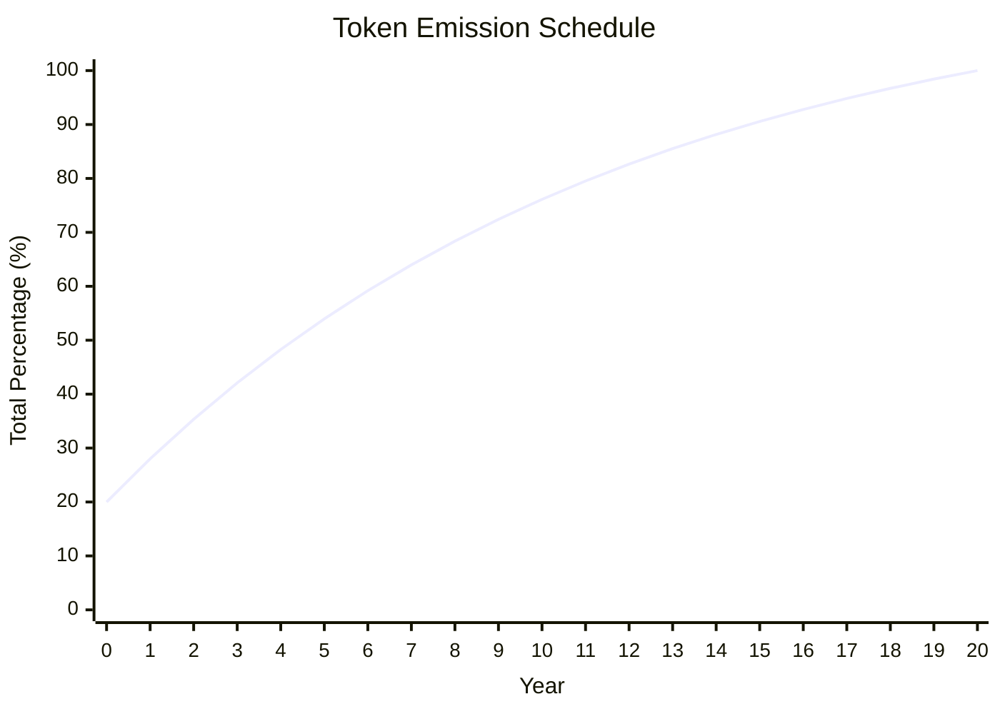

# Crynux Tokenomics

The CNX token serves as the utility token within the Crynux Network, facilitating the exchange of computational power. This role will expand in the future to include models and datasets. Applications use CNX to pay for AI tasks, while nodes earn CNX by executing them.

Beyond its use in paying for AI computation tasks, the CNX token is also integral to the governance of the DAO, including the election of the DAO Committee. This system ensures that Crynux remains a fully democratic, open, and community-governed organization, fostering its sustainable development in the long run.

The CNX token has a total supply of `CNX 8,617,333,262`. Which is the first 10 digits of the Boltzmann constant.

The CNX token is introduced through a fair launch. All tokens will be generated over a 21-year period in the form of node mining rewards. The majority of these tokens will be awarded to the node miners, while a smaller portion will be allocated to the DAO to support community development initiatives, such as application grants, and to cover development and marketing expenses.

## Token Emissions

In the early phase, when application demand is still limited, token emissions are used to incentivize nodes to provide compute capacity and help bootstrap the network. As the network grows and the number of applications increases, the income for node miners will gradually shift from token emission incentives to the task fees earned from executing AI tasks.

Token emissions are scheduled over 21 years (Year 0 through Year 20), beginning with the testnet launch on January 1, 2024; Year 0 spans the entire testnet period until mainnet, after which Year 1 begins. Year 0 is fixed at 20% of total supply, while Year 1 through Year 20 follow an Avrami emission curve and cease after Year 20 when the total supply is reached.

For Year 1 through Year 20, the cumulative emission ratio is modeled with a normalized Avrami form:

`F(y) = 0.8 * (1 - exp(-k * y^n)) / (1 - exp(-k * 20^n))`

where `y` is the year index for Year 1 through Year 20 (`1 <= y <= 20`), `k = 0.08544`, and `n = 1`. With `F(0) = 0` as the baseline, the annual emission ratio is `E(y) = F(y) - F(y-1)` for `y = 1..20`.

The Avrami equation originates from crystallization kinetics in materials science, where it describes how transformed fraction evolves over time during nucleation and growth. The name "Crynux" is inspired by this crystallization concept. Using this curve provides a practical benefit for network growth: application adoption takes time, so emissions are lower in the early years when there are fewer applications and less demand for compute, then relatively higher in the middle phase when ecosystem activity is stronger, before tapering again as the network matures.

> **Note (as of Mar 2026):**
> Mainnet is not live yet, the network is currently in testnet, and there are no CNX tokens in circulation.

```mermaid
xychart
  title "Token Emission Schedule"
  x-axis "Year" [0, 1, 2, 3, 4, 5, 6, 7, 8, 9, 10, 11, 12, 13, 14, 15, 16, 17, 18, 19, 20]
  y-axis "Total Percentage (%)" 0 --> 100
  line [20.0000, 28.0000, 35.3449, 42.0882, 48.2794, 53.9636, 59.1822, 63.9735, 68.3725, 72.4112, 76.1191, 79.5234, 82.6490, 85.5185, 88.1531, 90.5719, 92.7927, 94.8316, 96.7035, 98.4221, 100.0000]
```

| Year | Percentage | Total Percentage | Emitted CNXs | Total CNXs |
| :--- | :--- | :--- | :--- | :--- |
| 0 | 20.0000% | 20.0000% | 1,723,466,652.00 | 1,723,466,652.00 |
| 1 | 8.0000% | 28.0000% | 689,386,660.00 | 2,412,853,312.00 |
| 2 | 7.3449% | 35.3449% | 632,931,643.00 | 3,045,784,955.00 |
| 3 | 6.7434% | 42.0882% | 581,099,820.00 | 3,626,884,775.00 |
| 4 | 6.1912% | 48.2794% | 533,512,592.00 | 4,160,397,367.00 |
| 5 | 5.6842% | 53.9636% | 489,822,360.00 | 4,650,219,727.00 |
| 6 | 5.2187% | 59.1822% | 449,709,994.00 | 5,099,929,721.00 |
| 7 | 4.7913% | 63.9735% | 412,882,497.00 | 5,512,812,218.00 |
| 8 | 4.3989% | 68.3725% | 379,070,864.00 | 5,891,883,082.00 |
| 9 | 4.0387% | 72.4112% | 348,028,122.00 | 6,239,911,204.00 |
| 10 | 3.7080% | 76.1191% | 319,527,521.00 | 6,559,438,725.00 |
| 11 | 3.4043% | 79.5234% | 293,360,882.00 | 6,852,799,607.00 |
| 12 | 3.1255% | 82.6490% | 269,337,073.00 | 7,122,136,680.00 |
| 13 | 2.8696% | 85.5185% | 247,280,613.00 | 7,369,417,293.00 |
| 14 | 2.6346% | 88.1531% | 227,030,393.00 | 7,596,447,686.00 |
| 15 | 2.4188% | 90.5719% | 208,438,498.00 | 7,804,886,184.00 |
| 16 | 2.2207% | 92.7927% | 191,369,123.00 | 7,996,255,307.00 |
| 17 | 2.0389% | 94.8316% | 175,697,588.00 | 8,171,952,895.00 |
| 18 | 1.8719% | 96.7035% | 161,309,421.00 | 8,333,262,316.00 |
| 19 | 1.7186% | 98.4221% | 148,099,525.00 | 8,481,361,841.00 |
| 20 | 1.5779% | 100.0000% | 135,971,421.00 | 8,617,333,262.00 |
| **Total** | **100.0000%** | | **8,617,333,262.00** | |

> **Note:** Year 20 emission includes the rounding remainder to ensure the total emitted supply exactly matches `CNX 8,617,333,262.00`.

Tokens are emitted and distributed on a weekly basis. The number of tokens generated each week is based on the annual figures in the table above, and they are distributed according to the rules outlined below.

## Distribution of Token Emissions

### Year 0 and Year 1 Emission

| Item | Percentage    |
| ---- | --------------|
| Nodes         | 70%  |
| Treasury      | 30%  |
| Total         | 100% |

The first 2 years of emissions are distributed as 70% to nodes and 30% to the treasury.

The portion allocated to Nodes from Year 0 emissions is converted based on each node's testnet token balance at the testnet-end snapshot, then released from mainnet launch on a 12-month linear vesting schedule with daily distribution.

Year 1 emissions allocated to Nodes follow a 6-month linear vesting schedule with daily distribution.

From the treasury's allocation, 35% is designated for early Crynux developers, while the remaining 65% is reserved for future DAO operations.

### Year 2-20 Emissions

|       Item     | Percentage |
| -------------- | ---------- |
| Nodes          | 80%        |
| Treasury       | 20%        |
| Total          | 100%       |

For the emission distribution from Year 2 to Year 20, 80% of the tokens are allocated to nodes and the remaining 20% to the treasury.

Year 2-20 emissions allocated to Nodes follow a 6-month linear vesting schedule with daily distribution.

This structure is designed to heavily reward the nodes for providing the network's computational power, while also supporting the ecosystem's long-term growth through the DAO.

## Node Emission Calculation

The distribution of node emissions is directly tied to a node's contribution to the network, which is measured by the total task fees it earns during each weekly emission period. A node's share of the weekly emission pool is proportional to the amount of task fees it has collected relative to the total task fees collected by all nodes in the network.

For example, if a node earns 1% of the total task fees paid by applications across the network in a week, it will receive 1% of the total node emissions for that week.

This approach provides a simple yet effective mechanism for rewarding nodes fairly. The task fee a node earns is an organic reflection of its value to the network. A node's probability of being selected for tasks is determined by the performance (measured by the QoS score) and staking amount. Therefore, by pegging emissions to task fees, the system naturally rewards nodes that are both high-performing and contributed to the network's security. This creates a powerful incentive for all operators to maintain and improve their infrastructure, aligning individual node rewards with the overall health and efficiency of the network.
