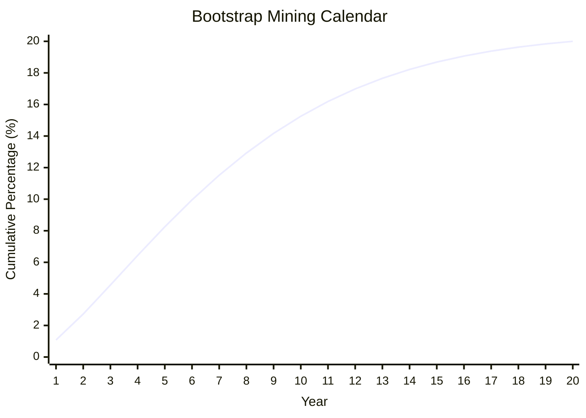

# Crynux Tokenomics

The CNX token serves as the utility token within the Crynux Network, facilitating the exchange of computational power. This role will expand in the future to include models and datasets. Applications use CNX to pay for AI tasks, while nodes earn CNX by executing them.

Beyond its use in paying for AI computation tasks, the CNX token is also integral to the governance of the Crynux DAO, including the election of the DAO Council. This system ensures that Crynux remains a fully democratic, open, and community-governed organization, fostering its sustainable development in the long run.

The CNX token has a total supply of `CNX 8,617,333,262`. Which is the first 10 digits of the Boltzmann constant.

Tokens will be generated in the form of node mining rewards. Node mining has two parts with different release rules: bootstrap mining and task mining. The majority of these tokens will be awarded to the node miners, while a smaller portion will be allocated to the DAO to support community development initiatives, such as application grants, and to cover development and marketing expenses.

## High-Level Allocation

| Part | Share of total supply | Timing |
| --- | --- | --- |
| Year 0 / Testnet | 9% | January 1, 2024 – June 17, 2026 |
| Bootstrap mining | 20% | Calendar Avrami schedule over Years 1–20 |
| Task mining | 71% | Released by network progress |

Year 0 accounts for 9% of total supply and spans the testnet period from launch on January 1, 2024 through mainnet launch on June 17, 2026.

After Year 0, node mining continues through two pools: **bootstrap mining (20% of total supply)** and **task mining (71% of total supply)**. Both are newly issued CNX paid to nodes. While application demand is still low, task fees alone are not enough to keep enough nodes online, so both kinds of mining are needed. Over time, node income is expected to rely more on task fees.

The two pools differ only in how tokens are released. Bootstrap mining releases on a calendar schedule. Each node's share of a weekly release follows the task fees it earned that week, including fees from heartbeat tasks and from application tasks. When there are not enough real application tasks, the network runs heartbeat tasks so there are still enough tasks and fees to settle that split. Task mining unlocks only from application tasks. Each node's share follows the task fees it earned from those application tasks.

## Node Emissions

Node emissions are the ongoing node mining rewards. They use two algorithms: bootstrap mining and task mining.

### Bootstrap Mining

A usable network needs enough nodes online before applications can run their tasks. In the early stage of the Crynux Network, application demand is still limited, and the task fees from those applications are not enough by themselves to keep enough nodes online. So bootstrap mining is needed when task fees are still insufficient.

Bootstrap mining is 20% of total supply, released on a calendar schedule over Years 1 through 20. Each week pays a known amount of mining rewards, whether or not applications have already filled the network with tasks.

Each node's share of a weekly release is calculated from the task fees it earned in that week, including fees from heartbeat tasks and from real application tasks. Heartbeat tasks exist so this fee-based split can still be computed when few applications are sending tasks.

This pool is released using a normalized Avrami curve.

#### Calendar schedule

For Year 1 through Year 20, the cumulative bootstrap mining ratio is:

`F(y) = scale * (1 - exp(-k * y^n)) / (1 - exp(-k * 20^n))`

where `y` is the year index (`1 <= y <= 20`), `scale` is the bootstrap mining pool = 0.20 of total supply, `k = 0.0538`, and `n = 1.4`. With `F(0) = 0`, the annual ratio is `E(y) = F(y) - F(y-1)`.

The Avrami equation originates from crystallization kinetics in materials science, where it describes crystallization and nucleation. The name "Crynux" is a combination of crystallization and nucleation.

The table below is the bootstrap mining calendar. The cumulative total at Year 20 is 20% of total supply.

```mermaid
xychart
  title "Bootstrap Mining Calendar"
  x-axis "Year" [1, 2, 3, 4, 5, 6, 7, 8, 9, 10, 11, 12, 13, 14, 15, 16, 17, 18, 19, 20]
  y-axis "Cumulative Percentage (%)" 0 --> 20
  line [1.0780, 2.7242, 4.5601, 6.4316, 8.2482, 9.9545, 11.5186, 12.9248, 14.1686, 15.2535, 16.1882, 16.9848, 17.6569, 18.2187, 18.6844, 19.0673, 19.3798, 19.6331, 19.8370, 20.0000]
```

| Year | Percentage | Total Percentage | Weekly Emitted | Emitted CNXs | Total CNXs |
| :--- | :--- | :--- | :--- | :--- | :--- |
| 1 | 1.0780% | 1.0780% | 1,786,492 | 92,897,584 | 92,897,584 |
| 2 | 1.6462% | 2.7242% | 2,727,986 | 141,855,272 | 234,752,856 |
| 3 | 1.8359% | 4.5601% | 3,042,483 | 158,209,116 | 392,961,972 |
| 4 | 1.8715% | 6.4316% | 3,101,410 | 161,273,320 | 554,235,292 |
| 5 | 1.8165% | 8.2482% | 3,010,312 | 156,536,224 | 710,771,516 |
| 6 | 1.7063% | 9.9545% | 2,827,694 | 147,040,088 | 857,811,604 |
| 7 | 1.5641% | 11.5186% | 2,592,055 | 134,786,860 | 992,598,464 |
| 8 | 1.4062% | 12.9248% | 2,330,245 | 121,172,740 | 1,113,771,204 |
| 9 | 1.2438% | 14.1686% | 2,061,165 | 107,180,580 | 1,220,951,784 |
| 10 | 1.0849% | 15.2535% | 1,797,889 | 93,490,228 | 1,314,442,012 |
| 11 | 0.9348% | 16.1882% | 1,549,089 | 80,552,628 | 1,394,994,640 |
| 12 | 0.7966% | 16.9848% | 1,320,097 | 68,645,044 | 1,463,639,684 |
| 13 | 0.6721% | 17.6569% | 1,113,750 | 57,915,000 | 1,521,554,684 |
| 14 | 0.5618% | 18.2187% | 931,051 | 48,414,652 | 1,569,969,336 |
| 15 | 0.4657% | 18.6844% | 771,710 | 40,128,920 | 1,610,098,256 |
| 16 | 0.3829% | 19.0673% | 634,560 | 32,997,120 | 1,643,095,376 |
| 17 | 0.3125% | 19.3798% | 517,890 | 26,930,280 | 1,670,025,656 |
| 18 | 0.2533% | 19.6331% | 419,687 | 21,823,724 | 1,691,849,380 |
| 19 | 0.2039% | 19.8370% | 337,827 | 17,567,004 | 1,709,416,384 |
| 20 | 0.1630% | 20.0000% | 270,197 | 14,050,268 | 1,723,466,652 |
| **Bootstrap mining total** | **20.0000%** | | | **1,723,466,652** | |

> **Note:** Year 1 through Year 20 bootstrap mining emissions are rounded to integer weekly emissions, with the remaining rounding difference included in Year 20 so this pool total matches the designed pool size.

#### How a weekly release is allocated to nodes

The distribution of bootstrap mining among nodes is tied to each node's contribution to the network, measured by the total task fees it earns during each weekly emission period. A node's share of the miner portion of that week's bootstrap mining release is proportional to the amount of task fees it has collected relative to the total task fees collected by all nodes in the network.

For example, if a node earns 1% of the total task fees across the network in a week, it receives 1% of that week's bootstrap mining allocated to nodes.

Heartbeat tasks keep this calculation working when few applications are sending tasks. The network continuously creates heartbeat tasks. A heartbeat task is an ordinary AI task: it is dispatched to nodes, it pays a task fee, and that fee is included in the weekly task-fee total. When applications send real tasks, those task fees are included in the same total.

A node's probability of being selected for tasks is determined by its performance (measured by the QoS score) and staking amount. Because emissions follow task fees, nodes that are selected more often, complete more work, and earn more fees also receive a larger share of bootstrap mining.

### Task Mining

Bootstrap mining keeps nodes online even when few applications are sending tasks. Task mining is the larger node mining pool, 71% of total supply. It is also paid to nodes. Tokens leave this pool according to completed application tasks, and each node's share of a release follows the task fees it earned from application tasks in that period.

This pool is released according to network progress, in a way similar to [Filecoin's baseline minting](https://spec.filecoin.io/#section-systems.filecoin_token.block_reward_minting.baseline-minting). A planned path gives the expected cumulative application tasks over time. Actual completed application tasks map onto that path as **effective network time**. Task mining is released when effective network time advances by a full step. The pool may finish earlier or later than 20 years.

#### Effective network time

Task mining needs a planned path for how many application tasks the network should have completed by each month. That path is built from target node capacity: month `a` has a target node count, a utilization share of their capacity is assumed to run application tasks, and that used capacity is converted into a planned task count for the month. Summing those monthly counts gives the planned cumulative path. Effective network time is the point on that path that matches the actual cumulative number of completed application tasks.

Let `a` be the month index from the start of task mining.

Target node count:

`N(a) = b0 * exp(g * a)`

Network utilization:

`μ(a) = 1 - exp(-a * ln(2) / h)`

Planned application tasks in month `a`:

`K(a) = μ(a) * (86400 * 30 * N(a)) / t_hat`

where `t_hat` is the estimated time to execute one task.

Cumulative planned tasks:

`K_cum(a) = sum_{i=1}^{a} K(i)`

Let `K_actual` be the cumulative number of completed application tasks. Effective network time `t` is the largest integer `a` such that `K_cum(a) <= K_actual`. The parameters `b0`, `g`, `h`, and `t_hat` are fixed.

#### Emission amount

The release size does not use calendar time. It uses effective network time on an Avrami curve over the task mining pool. When effective network time advances by one full step, the network releases the matching step on that curve. If it does not advance by at least one step, no task mining is released.

When effective network time advances from `t - 1` to `t`, the cumulative task mining release is:

`F(t) = scale * (1 - exp(-k * (c1 * t + c0)^n))`

with `F(0) = 0`. The step release is `E(t) = F(t) - F(t - 1)`, where `scale` is the task mining pool = 0.71 of total supply, and `k`, `n`, `c0`, and `c1` are fixed curve parameters.

#### How a period's release is allocated to nodes

A node's share of the miner portion of a task mining release is proportional to the task fees it earned from application tasks in that period, relative to the total application task fees earned by all nodes in the same period. Only task fees from application tasks are used.

For example, if a node earns 1% of the total application task fees across the network in a period, it receives 1% of that period's task mining allocated to nodes.

## Distribution of Token Emissions

### Year 0 / Testnet

| Item | Share of total supply |
| ---- | --------------------- |
| Nodes | 3.0% |
| Treasury | 6.0% |
| Total | 9.0% |

The portion allocated to nodes from Year 0 is converted based on each node's testnet token balance at the testnet-end snapshot, then released from mainnet launch on a 12-month linear vesting schedule with daily distribution.

From the Year 0 treasury allocation, 35% is designated for early Crynux developers, while the remaining 65% is reserved for future DAO operations.

### Bootstrap Mining and Task Mining

| Item | Percentage |
| ---- | ---------- |
| Nodes | 80% |
| Treasury | 20% |
| Total | 100% |

For bootstrap mining and task mining, each release is distributed as 80% to node miners and 20% to the treasury.

Node rewards from these releases follow a 6-month linear vesting schedule with daily distribution.
